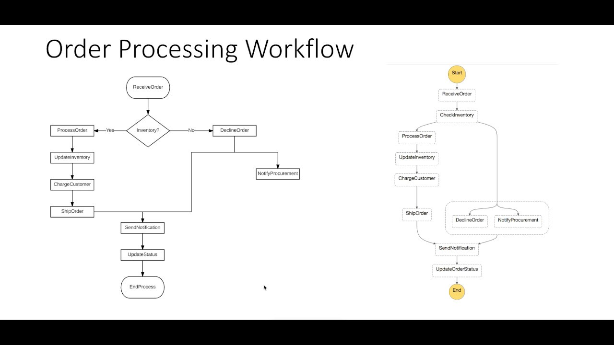

# AWS Step Functions to manage Lambda functions flow

### Functions into App
- "I want to sequence function."
- "I want to run functions in parallel."
- "I want to select functions based on data."
- "I want to retry functions."
- "I want try/catch/finally."
- "I have code that runs for hours." 

If you want all functions mentioned above, then you can use aws step functions.

### DEMO
On this example, you will see how we can implement `Order Processing Workflow` 
by using `AWS Step Functions`.



### Build and Deploy
Before build the project we need to install following dependencies
```bash
npm install -g serverless
sudo apt-get install jq
```

Let's install node dependencies
```bash
npm install
```

Finally,
```bash
./deploy.sh
```