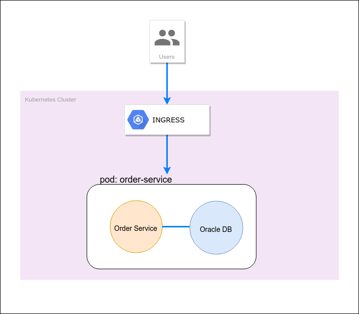

Spring Boot Oracle DB in Kubernetes
---
The demo for kubernetes to deploy spring boot application with oracle database.

## Pre-Requisities
- Kubectl CLI installed and configured
  - Snap package for kubectl
    ```bash
    sudo snap install kubectl --classic
    ```  
  - For configuration setup refer [here](https://kubernetes.io/docs/tasks/tools/install-kubectl/#configure-kubectl)  
- Helm CLI installed
  - Snap package for helm
    ```bash
    sudo snap install helm
    ```

### Create helm chart for spring boot
```bash
mkdir helm && cd helm
helm create k8s-spring-boot
```
Modify files one by one in the folder `helm/spring-boot`:
- **values.yaml**
    ```yaml
    ...
    service:
      ...
      port: 8080    
    ingress:
      enabled: true
      ...    
      hosts:
        - spring-boot-oracle-db-in-kubernetes.local
    ...
    ```
- **deployment.yaml**
    ```yaml
    ...
    env:
    - name: "SPRING_DATASOURCE_URL"
      value: jdbc:oracle:thin:@//oracledb:1521/XE
    ports:
      - name: http
        containerPort: {{ .Values.service.port }}
        protocol: TCP
    livenessProbe:
      httpGet:
        path: /actuator/health
        port: http
    readinessProbe:
      httpGet:
        path: /actuator/health
        port: http
    ...
    ```

### Create helm chart for oracle db
```bash
cd helm/k8s-spring-boot/charts
helm create oracledb
```
Modify files one by one in the folder `helm/oracle-db`:
- **values.yaml**
    ```yaml
    ...
    service:
      ...
      port: 1521
    ...
    ```
- **deployment.yaml**
    ```yaml
    ...
    ports:
      - name: oracledb-port
        containerPort: {{ .Values.service.port }}
        protocol: TCP
    livenessProbe:
      tcpSocket:
        port: oracledb-port
    readinessProbe:
      tcpSocket:
        port: oracledb-port   
    ...
    ```
- **service.yaml**
    ```yaml
    ...
    metadata:
      name: oracledb
    ports:
      - port: {{ .Values.service.port }}
        targetPort: oracledb-port
        protocol: TCP
        name: oracledb-port
    ...
    ```
    
### Build, Publish & Deploy
```bash
make all GROUP=aaaaa KUBE_API_ENDPOINT=kube.aaaaaa.io
```

### Test
```bash
curl -X GET http://api.spring-boot.<GROUP>.<KUBE_API_ENDPOINT>/orders
curl -X GET http://api.spring-boot.<GROUP>.<KUBE_API_ENDPOINT>/actuator/health
```

For more detail please refer `Makefile`.

### Architecture

